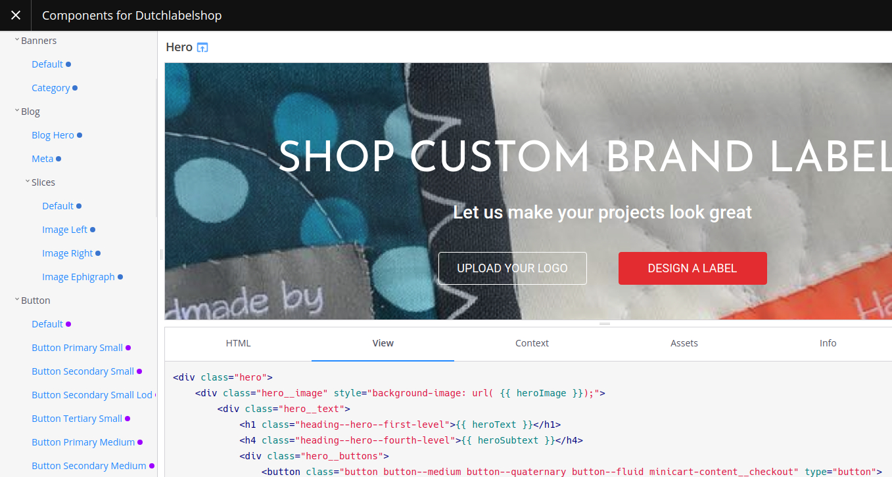
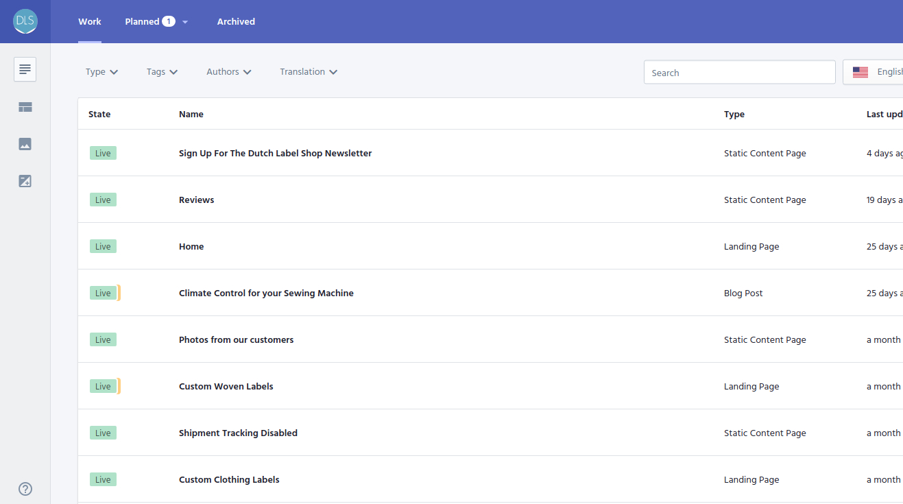
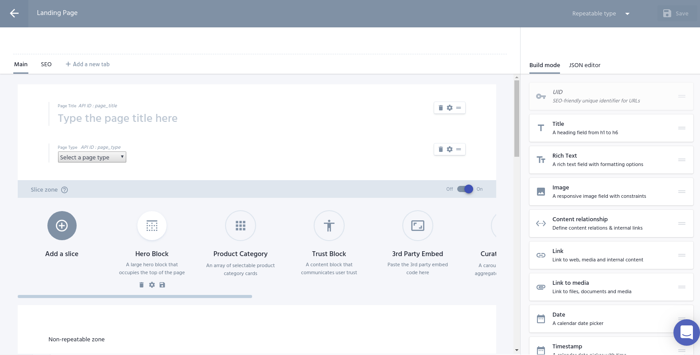

A completely revamped Magento 2 e-commerce platform to drive Dutch Label Shop's success in the custom label market.

## Dutch Label Shop
In the age of ecommerce and Etsy, crafters are afforded the opportunity to bring their passions to life in a way like never before. Boutique owners can now turn a collection of handmade garments into a profitable and professional brand. Dutch Label Shop offers these creative artisans a line of products to proudly and definitively identify their work as their own. Dutch Label Shop offers four types of high-quality customized labels —Brand, Size, Care, and Hang Tags— in quantities as low as 30.

## The challenge
Dutch Label Shop approached us to do a rebuild of their IT infrastructure. Their previous shop (also built by us) was running on Magento 1, which is approaching end of life in June 2020. 

A large part of the codebase was for processing of the orders after they were placed to support the production process. We leapt at the opportunity to re-architect the codebase to make the system more robust, flexible and versatile.

We planned our work in two-week sprints and our client spent one day a week at our office to guarantee a short feedback cycle.

## Migrating from Magento 1 to 2

We had many years of customizations built into the Magento 1 installation which culminated in 75 custom-built extensions. Our first step was to sit with the client team to discuss every single extension that we used in the Magento 1 shop and assess whether we need to skip it, port it or find an alternative for the Magento 2 build.

## Service Oriented Architecture

The project consists of many different but inter-related parts. In the Magento 1 webshop we had incorporated everything into Magento 1, which eventually proved not the best solution. Magento is great at what its built for but forcing it to take on responsibilities it wasn't meant to have pushed us from time to time in awkward positions. We decided to take a service oriented architecture approach, segmenting the different but inter-related parts of the codebase into systems that do that particular job best and eventually weave it into the Magento fabric.

This meant splitting the system up in a number of distinct parts;

- Frontend components
- Content management
- Product designers & uploaders
- Product library
- Pricing library
- A number of microservies for smaller tasks
- A middleware layer for the production facility

This case study will expand on each of them to shed some light on how we think a modern Magento 2 stack could function.

## Frontend components

The designer at Dutch Label Shop designed the website in close collaboration with our frontend team. The new shop was designed using Figma, which allowed us to easily collaborate on the designs and the frontend implementation with the team at Dutch Label Shop.

Having a single source of truth with versioning and full transparency & history was a great advantage when transforming the designs into an actual frontend implementation. To create a uniform look and feel completely tailored to Dutch Label Shop's visual identity, we decided to create all frontend components from scratch and not fall back on any defaults (whether from Magento or another third party library). To achieve this, we built a component library and a styleguide using [Fractal.js](https://fractal.build/) - trusted by City of Boston, City of Ghent, Liip and Eurostar among others.

Building the frontend components in the component library created a short feedback cycle between our frontend developers and the client team - every change our developers made would trigger a build pipeline that would update the component library. The client team could then quickly check progress and adjust where necessary.

After all components were created and the HTML and CSS for them was ready, we implemented the HTML into our Magento 2 theme. The CSS is directly included from the component library, eliminating all Magento-core CSS. This optimizes the delivery of CSS - no unused CSS is sent to the visitor's browser.

## Content management

Accompanying the Magento 1 webshop, the customer had a Wordpress site running for all blog content. Unifying the blog content with other site content was a big wish from the clients' content team. So we were in the market for a content management system that allowed us to:

- Flexibly create content types (such as blogs, landing pages, faqs, etc)
- Have granular control over users and permissions
- Preview content in the actual design
- See the history of changes in content (versioning)
- Manage every content item in multiple languages
- Fetch all the content through a REST (or GraphQL) endpoint

These requirements boiled the list down to a few systems;

- Contentful
- Cockpit
- Butter CMS
- Prismic.io
- DatoCMS

We had several calls with each of these and reviewed their demos thoroughly with the client's content team to see which system best suited our requirements and preferences. We eventually decided to go with [Prismic.io](https://prismic.io/non-developer).

Unfortunately, there was no Magento 2 extension available to connect Prismic with Magento 2 to create a seamless experience for the content team. Since we were (and still are!) so enthousiastic about Prismic, we decided to write the extension ourselves. We also open sourced it - you can find it on our [Github repo elgentos/magento2-prismicio](https://github.com/elgentos/magento2-prismicio).

## Product designers & uploaders

## Product library

## Pricing library

## Microservices

### PDF to PNG

### Color Extractor

### Translations

### Image generation

## Business processes

## Middleware

